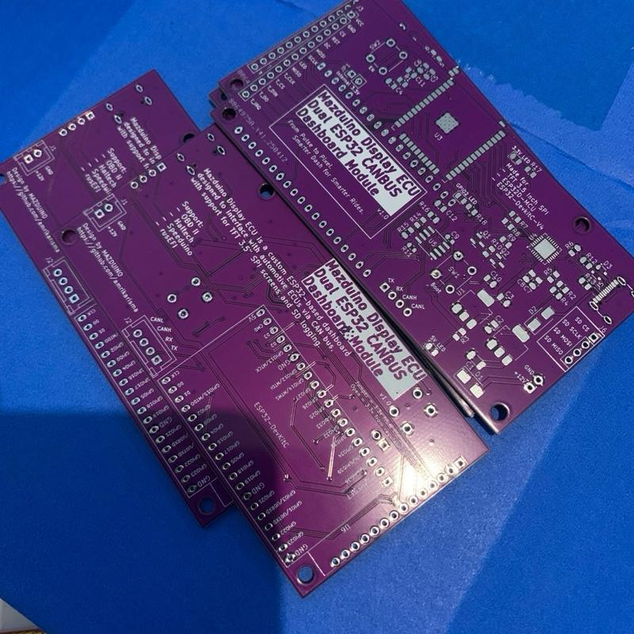

# Mazduino DASH CANBus
Mazduino DASH CANBus is an ESP32-based project that enables communication using the CAN (Controller Area Network) protocol. This project is designed to read and display data from a vehicle's ECU using a CANBUS module.

### Key Features:
- Communication with ECU using the CAN protocol.
- Support for real-time data display.
- Easy integration with other hardware.

### Photo
Showcasing the hardware used.

### Video
Demonstrating the device in real-world applications.

<video width="640" height="360" controls>
  <source src="assets/canbus-display.mp4" type="video/mp4">
  Your browser does not support the video tag.
</video>

## How to Buy a PCB?
- [Buy on Tokopedia](https://tk.tokopedia.com/ZSkFr6LX6/)
- [Visit Mazduino](https://www.mazduino.com)

## References:
- [Haltech CAN ECU Broadcast Protocol](https://support.haltech.com/portal/en/kb/articles/haltech-can-ecu-broadcast-protocol)